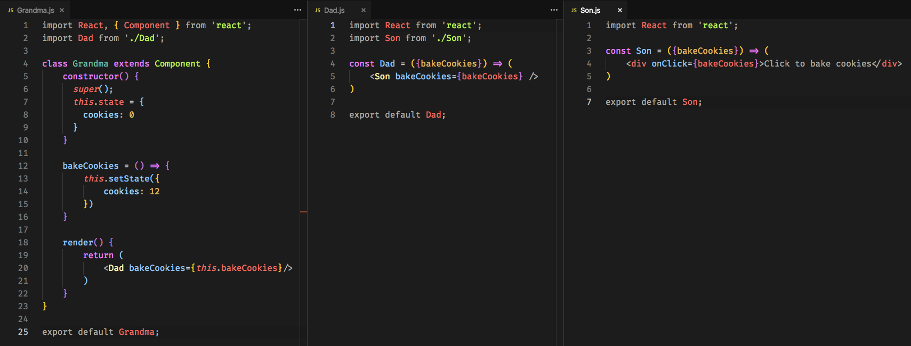
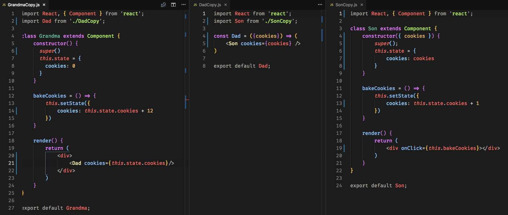
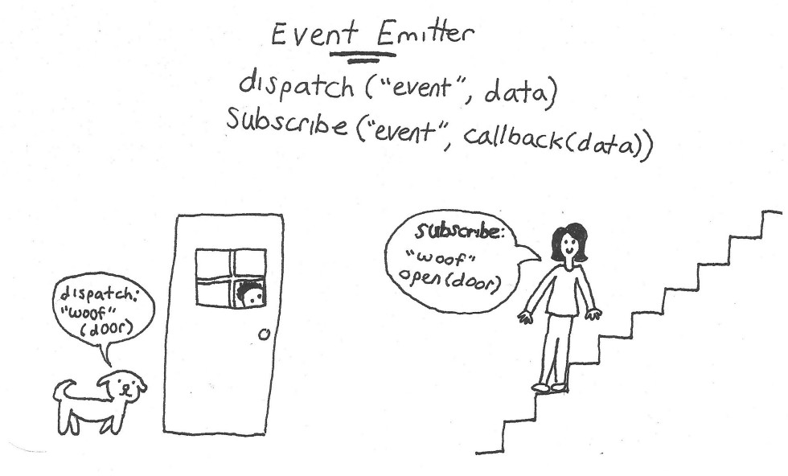
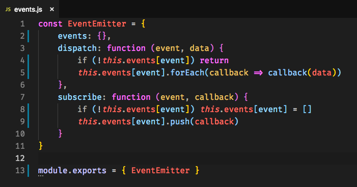
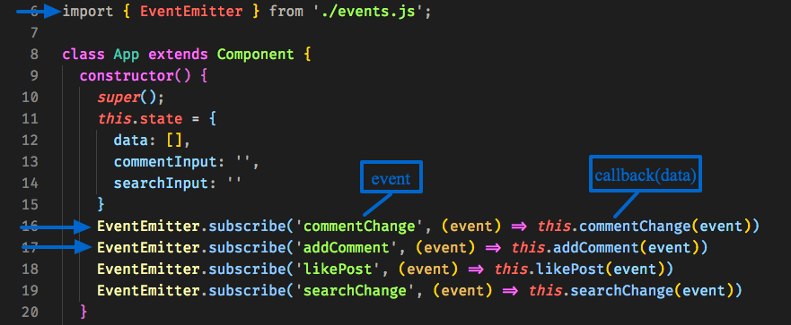
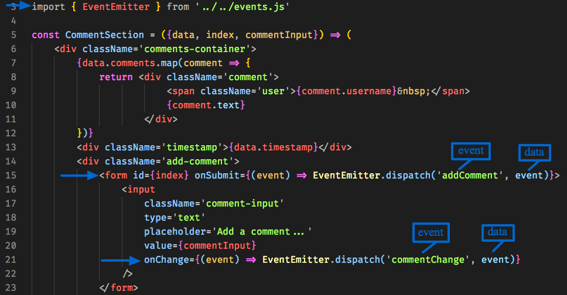

## Task

You want a grandchild component to be able to trigger its grandparent component’s method in React. You could pass the method as a prop down the family tree of components to the appropriate grandchild component (this is an example of [prop drilling](https://medium.com/@MCapoz/passing-data-in-react-with-prop-drilling-904aeb3cb5e)). Here is a demonstrative code sample:

But there are some issues with this prop drilling pattern:

* It can require a great deal of repetition
    
* For example, intermediate components must act as messengers between the desired endpoints (grandparent & grandchild), which makes the event coordination brittle — if you remove or refactor any component in the middle of the chain, it can break your app
    
* Furthermore, this pattern becomes more and more cumbersome the deeper your nested components go. You may have a parent component with 5 layers of nested children, and even if only the final child needs the prop drilled function, the prop still has to pass through every single intermediary.
    
* Personally, this pattern feels unnatural in that it doesn’t structurally reflect my intent. My desire is to have a grandchild of arbitrary depth be able to signal for the invocation of a function that belongs to its grandparent of arbitrary depth. Ideally, I would even be able to do this across non parent/child component relationships, like sibling or cousin components, which is not easily accommodated by prop drilling.

Instead of passing a function down as a prop in order to let the grandchild update the grandparent’s state, you could also pass down an initial state (an object, not a function). Then, have the grandchild update that state locally however it likes. Here is an example of that:

There are a number of issues with this distributed state pattern as well:

* It creates multiple (conflicting) sources of truth, undermining the integrity of state
    
* It doesn’t effectively resolve the core issue with event communication between distant components, just works around it (i.e., you still can’t communicate between sibling or cousin components)
    
* It is essentially a more intuitive but less effective method of prop drilling than just passing a function. It may be easier to reason about an object being passed as a prop, but this pattern has all the downsides of the regular function passing prop drilling pattern, as well as its own problems.

I’m here to offer you an alternative to these two approaches, which instead meets the following criteria:

* Establishes a single source of truth
    
* Eliminates intermediate messengers & reduces prop drilling
    
* Better isolates responsibilities of stateful & functional components (ie. stateful components are responsible for calling their own methods to update state; functional components aren’t directly acting on state)
    
* Relatively simple to implement; doesn’t require external libraries

## Event Emitter Approach

The alternative I prefer is to use an event emitter. An event emitter establishes a direct line of communication between the two desired endpoints, removing the need to pass event information (data, callbacks) through intermediate components. The event emitter that I implemented has two types of actions — dispatch and subscribe. These aren’t special keywords; they could instead be called publish and subscribe (pub-sub), send and receive, speak and listen, egg and mango, etc. It is important to note that more actions can be defined and used, such as unsubscribe (which would be important in non-trivial applications).

Here is a real world metaphor to illustrate dispatch and subscribe. When the dog sees a person at the door, it dispatches a signal (“woof”), and by standing at the door, also sends the data that the woof was related to the door. The care-taker is tuned into woofs and knows to open the door when the dog woofs beside it. The dog itself couldn’t open the door and the person couldn’t see if someone was at the door so they worked together with their respective information and abilities to achieve this chain of events.

To demonstrate my event emitter in React, I’ll share pieces of an [Instagram clone](https://github.com/lolax/React-Insta-Clone) I’ve been working on as a student at [Lambda School](https://lambdaschool.com/). First, I need to define the event emitter, which is simply an object that we can import to other components as needed.

Next, I want to import EventEmitter to components that will be subscribing to an event and then set up the subscribe functionality. The name of the event that you pass can be whatever you like. Because its purpose is to associate two signals, the name of the event just has to match in the corresponding dispatch and subscribe. Here, I decided to call the event by the name of the callback function.

Finally, I will repeat those same steps for the dispatch: import EventEmitter and set up the dispatch functionality. These are the dispatches that correspond to the two subscribes above.

Now your components have a direct line of communication to coordinate events!

Let’s revisit the benefits of this approach:

* Single source of truth
    
* Event coordination transcends the hierarchy of your app’s composition and eliminates the need for intermediary messenger components to be passed event-related props for components that need them farther down the tree
    
* The core idea is familiar (illustrated by dog example) and reflected in human interaction
    
* Scales effectively with project/component tree complexity

A few drawbacks to note:

* The setup it requires may be more work than it’s worth for simple or flat applications with minimal event-related communication between components

* It may be confusing to other developers, although event emitters are a widespread pattern, as referenced below.

* If you want to pass multiple parameters to this event emitter, you’ll need to contain them in a single object or array — similar to wrapping multiple elements in a single container `
` for a return statement.

## Context

If this event emitter pattern seems useful to you, you’re not alone. [Node](https://nodejs.org/api/events.html#events_class_eventemitter), [Vue](https://vuejs.org/v2/guide/components-custom-events.html), and [Angular](https://angular.io/api/core/EventEmitter) all feature some variation of built-in event emitters or an event bus. Redux handles this exact task, as well. It takes a bit more work to use an event emitter in pure React, but I’ve found the effort to be worthwhile. I welcome all corrections/questions/suggestions you’d like to share :)

