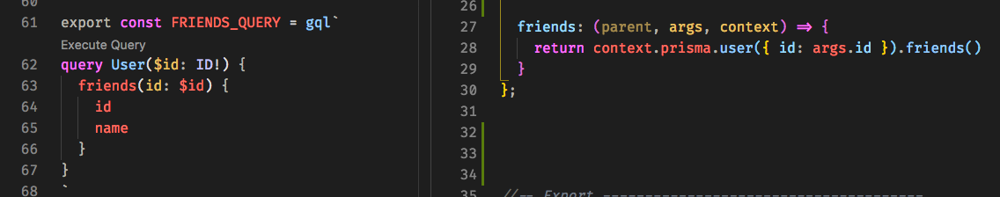
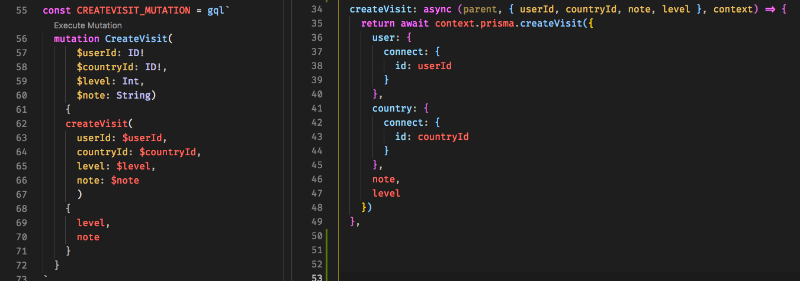
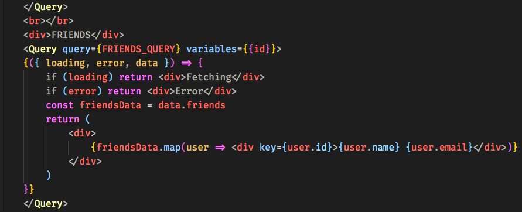
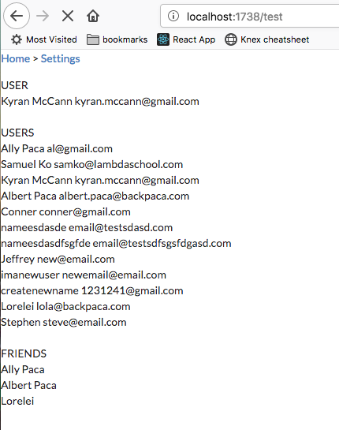

## Part 1 - Individual Contributions

### Contribution Graph

https://github.com/Lambda-School-Labs/labs9-map-scratcher/graphs/contributors
My handle is @lolax

### Whiteboarding
https://www.youtube.com/watch?v=oMq6cVNs6TM

### Summary

While I have more pull requests for front end, my work this week was fairly balanced between front end and back end. As a team, our efforts for the first half of the week were dedicated to planning and negotiating strategy; those efforts are not reflected in trello cards or PRs, but they were no less integral. My back end PR was a combined effort with several other members of my team. It represents the first steps we took to establish a foundation for the new technologies we chose to work with. My front end contributions consisted of refining our map component, adding preferences for the prettier extension to assist in standardizing our formatting, and expanding the map page component to reflect the basic elements in the wireframe for that page with some light styling for layout. 
	
### Tasks Pulled (Ordered Chronologically)

**Front End**
	Fix Map Rendering
        https://github.com/Lambda-School-Labs/labs9-map-scratcher/pull/29
        https://trello.com/c/3dVRyG61/53-fix-map-rendering-visibility
    Connect Frontend to Backend
        https://github.com/Lambda-School-Labs/labs9-map-scratcher/pull/34
        https://trello.com/c/92SRC3lx/56-display-data-from-yoga-server-on-frontend-using-apollo-client
    Expand Country View Modal
        https://github.com/Lambda-School-Labs/labs9-map-scratcher/pull/59
        https://trello.com/c/A5LU0bTv/15-country-modal
    Abstract and Translate Yoga Mutations to Apollo Client
        https://github.com/Lambda-School-Labs/labs9-map-scratcher/pull/62
        https://github.com/Lambda-School-Labs/labs9-map-scratcher/pull/64
        https://trello.com/c/LyKsKyeu/86-abstract-queries-mutations

**Back End**

    Finish Yoga Mutations & Queries
        https://github.com/Lambda-School-Labs/labs9-map-scratcher/pull/41
        https://github.com/Lambda-School-Labs/labs9-map-scratcher/pull/43
        https://github.com/Lambda-School-Labs/labs9-map-scratcher/pull/49
        https://github.com/Lambda-School-Labs/labs9-map-scratcher/pull/52
        https://trello.com/c/RHvdduLp/42-yoga-resolvers-queries-and-mutations-included

    

### Detailed Analysis

The task from this I'd like to expound upon was the abstraction and translation of yoga mutations & queries into apollo-client readable requests. These can be written above a component, but early on we discussed that it would be ideal to abstract our apollo queries & mutations out of the components. I made two files; one to export queries and the other to export mutations. Next I had to write the queries and mutations themselves, which involved some modification from how they'd be written in the GraphQL Playground. To write these, I referred to where each query and mutation was defined in the backend. Here is a side-by-side comparison with the apollo query or mutation on the left and its definition in the backend on the right.

After this step, we could import the query or mutation into the relevant component and make use of  it. For the example below, we specified the query and the necessary variables in a Query component. Finally, we dictate how the return data should be displayed.

The result of serveral of these test queries is this output on the client:

## Part 2 - Milestone Reflections

As a part of your journal entry, write ¼ to ½ a page reflecting on your experiences working with a team to integrate several servers, pages, APIs, and services into one project. Describe how your pieces of the project interfaced with and integrated with your teammates.

As last week consisted of instantiating and preparing all of the pieces of our application, this week was dedicated to connecting them. Early on, this involved updating our datamodel for users and the mutation to create new ones to accommodate using Twitter Oauth. This was the first of several instances where multiple potential solutions exisited, often one demanding more from the server and the other relying on more work from logic in the frontend. Integrating our first query into the frontend, fetching all user data, was relatively straightforward. However, it took more time than anticipated to include mutations and queries requiring variables. Ultimately, we exceeded the expectations of this week's milestones. However, the progress we made was undeniably slowed by the newness of our stack. We functioned better as team this week, as we've each learned to choose our battles and avoid needless conflict. One strategy that helped immensely in minimizing confusion and incompatibility within our team as we put the pieces of our application together this week was our frequent pairing sessions. Working in pairs or even threes maximizing team member understanding of our app as a whole. Rather than each person being an expert in one isolated part of it and struggling to see how each piece will fit together, each person on our team has an adequate understanding of the complete architecture. 