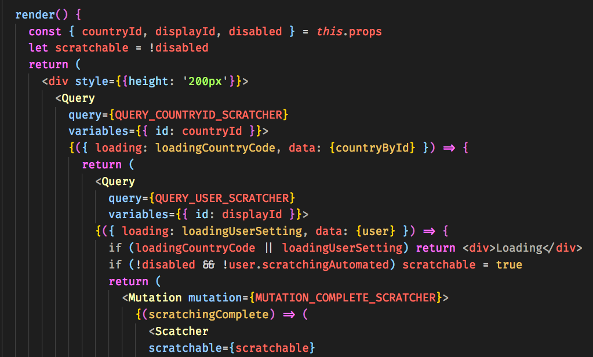
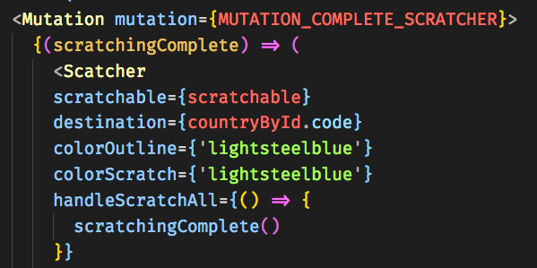
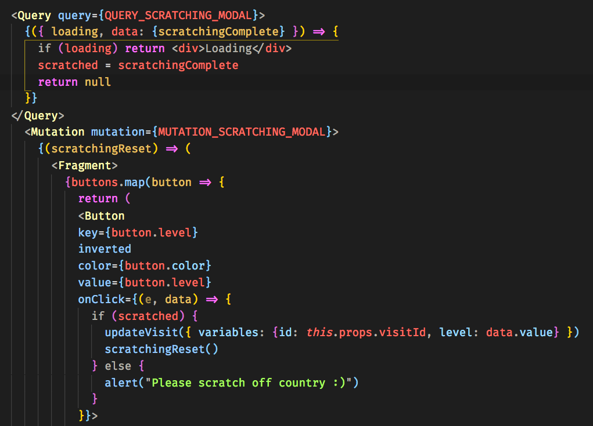

## Part 1 - Individual Contributions

### Contribution Graph

https://github.com/Lambda-School-Labs/labs9-map-scratcher/graphs/contributors
My handle is @lolax

### Summary
This week I primarily worked with Apollo to get data and requests connected with our various components. I was surprised by how many unique challenges I experienced in the process of working to this end. Other than unexpected behaviors and difficulty establishing a transferrable understanding of Apollo between moving parts, the greatest challenge I faced was accepting the nesting and clutter that its ecosystem creates. Each query and mutation is a component and something as simple as the button to change your level of visit ended up with three queries, two mutations, for a grand total of about 70 lines of code. It will take time for me to acclimate to this component overcrowding, but I suspect that acclimation will still not do much to improve my desire to use Apollo Client again.
 
	
### Tasks Pulled (Ordered Chronologically)

**Front End**
	Profile Page & Components
        https://github.com/Lambda-School-Labs/labs9-map-scratcher/pull/78
    Country Modal: Fixed Mutatations, Added Refetch
        https://github.com/Lambda-School-Labs/labs9-map-scratcher/pull/85
     Scratcher Gatekeeping for Visit Updates
        https://github.com/Lambda-School-Labs/labs9-map-scratcher/pull/90

**Back End**

    Apollo Client Query & Mutations
        https://github.com/Lambda-School-Labs/labs9-map-scratcher/pull/68

    Updates to Mutations and Local State
        https://github.com/Lambda-School-Labs/labs9-map-scratcher/pull/75/
    

### Detailed Analysis

The components I worked on this week that had the most complex interconnected logic were the scratcher and the aforementioned buttons responsible for updating a users visit. Whether or not the scratcher is active depends on whether you're viewing the country modal from your own map or from a friend's. If it's your map, the scratcher then needs to know whether "Automated Scratching" is set in your settings (which persist indefinitely on the server). 

It will only be scratchable if you're viewing the modal from your map (detemined through props) and your settings indicate that your "Automated Scratching" setting is set to false.

The scratcher also receives a callback to invoke upon scratching completion. I created muations and resolvers to update client state for a field I called "scratchingComplete."

I decided to use client state because the scratcher needed to quickly emit to the update visit button that scratching was complete. The speed at which client state can be updated and read by other components has been arguably the most redeeming aspect of Apollo Client. In the button component, it has a query for that client state, which updates a variable in the component that acts as the gatekeeper for the actual updateVisit mutation. When it receives signal that scratching is complete, it calls the mutation to update the visit, then resets the scratcherComplete status on client state.

## Part 2 - Milestone Reflections

The greatest challenge we faced throughout the process of completing our app has been familiarizing ourselves not only with at least six new services and frameworks, but understanding the intersection of each of these new tools. The undertakings of debugging and integrating disparate components are magnified. We need to not only understand Next, Apollo Client, GraphQL Yoga, Prisma, and Leaflet, but each permutation of interaction between them. Our leading strategy to overcome this challenge has been for everyone to learn as much about all of our stack as possible, rather than each person specializing, to fill in the gaps that would exist in our understanding of how each piece interfaces with the others.
