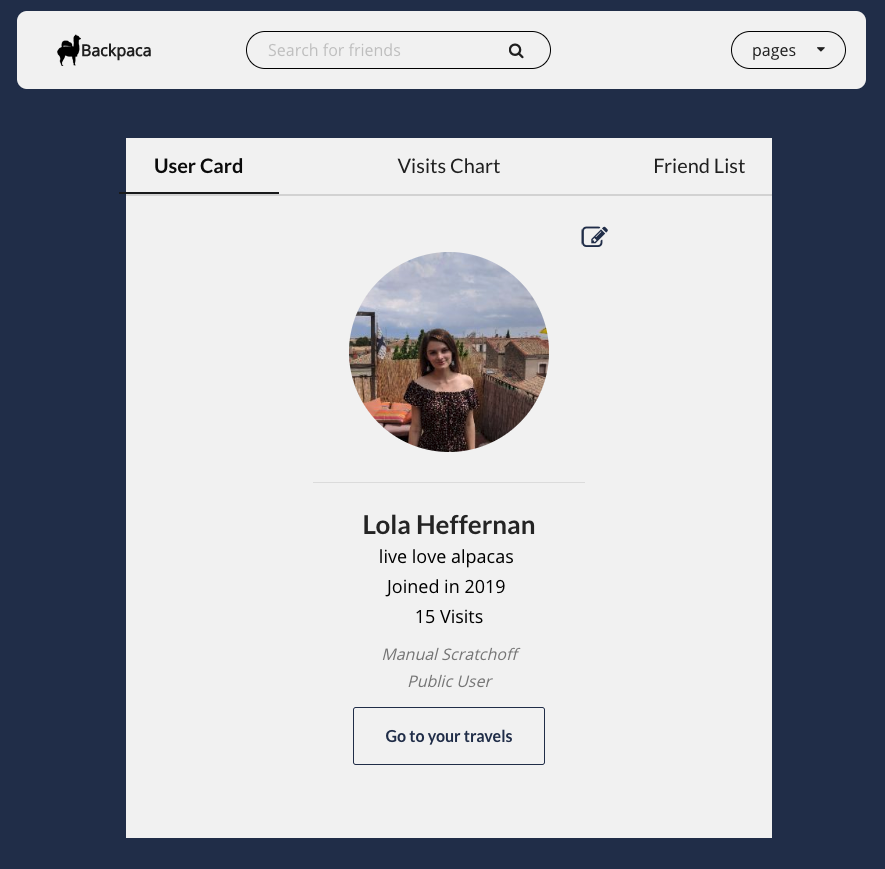
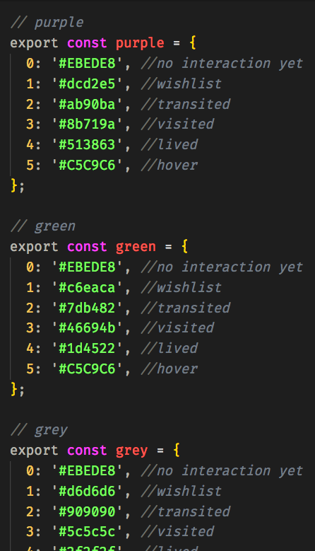
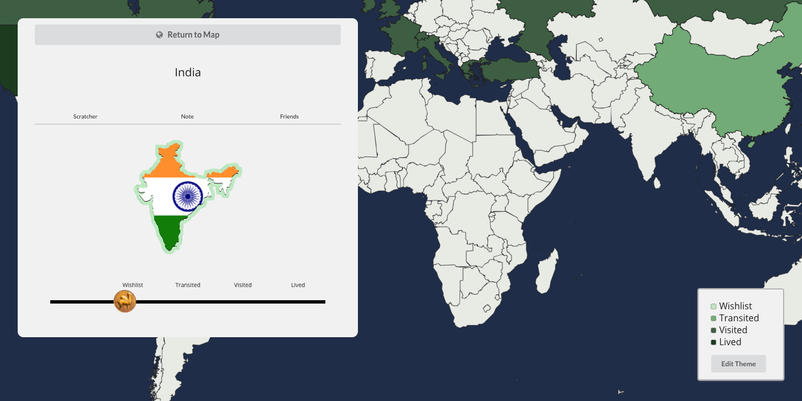

## Part 1 - Individual Contributions

### Contribution Graph

https://github.com/Lambda-School-Labs/labs9-map-scratcher/graphs/contributors
My handle is @lolax

### Summary
The work I did this week began on Saturday of the previous week when a teammate, Kyran, and I decided to pursue a dramatic change to our project. Setting out to remove Next.js from a project that had been built around it for weeks was so involved that I made a (brand new repository)[https://github.com/lolax/Nextless-Backpaca] for our experiment rather than simply branching. It was satisfying to refactor our entire project to take out something that was ill-fititng and had been causing problems that seemed insurmountable in the time remaining. We replaced Next's routing with react router dom, Oauth with Auth0, and LESS with SASS. On Monday, we got approval from the rest of the team to push & merge to our main repository. The rest of the week was spent largely on much-needed styling, _still_ trying to get some buttons and our map to update dynamically, and adding a few small high-impact features (map themes & visit distribution chart). 
 
	
### Tasks Pulled (Ordered Chronologically)

**Front End**

	Fixed Map Theme Buttons
        https://github.com/Lambda-School-Labs/labs9-map-scratcher/pull/174
    Map Themes & New Profile Layout
       https://github.com/Lambda-School-Labs/labs9-map-scratcher/pull/170
    Visit Distribution Pie Chart
        https://github.com/Lambda-School-Labs/labs9-map-scratcher/pull/158
    Friend Card Buttons Updating
        https://github.com/Lambda-School-Labs/labs9-map-scratcher/pull/155

**Back End**

    Cors Fixed for Deployment     
        https://github.com/Lambda-School-Labs/labs9-map-scratcher/pull/150
    Next.js Removal & Oauth Replacement with Auth0
        https://github.com/Lambda-School-Labs/labs9-map-scratcher/pull/141

### Detailed Analysis

My most sizable pull request this week, aside from the complete refactor that I described in the summary, was a redesign of the profile page and the addition of map themes. When I drew up my originaly sketches for the profile page, I envisioned it with a three tab menu at the top to switch out content on mobile. This seemed preferrable to having the content stacked vertically. We had designed the desktop layout with the three main elements arranged horizontally. It looked fine, but the asymmetry and imbalance of having one chart without a defined card around it beside two card elements (the user card and friends list) was not ideal. I also realized that it was going to be a bit of a hassle to reconcile the desktop and mobile layout with semantic ui. With this in mind, I decided to explore keeping the tab layout for desktop. Ultimately, I felt that it was a much cleaner and visually focused design, which seamlessly transitions across screen dimensions.

After working on the profile page, I set out to implement a feature I'd been thinking about for a few weeks: map themes. I personally appreciate user color themes (twitter has them for instance) and if we couldn't settle on a singular map theme as a team, then it would be reasonable to assume that users would have disparate preferences as well. First, I created a handful of color theme objects that the user would be able to choose from. 

Next, I made a proof-of-concept by adding buttons directly onto the map to make sure that it would update. After verifying that the map itself could be updated, I moved the theme-changing logic to the travels page because it's the parent element of everything that would be involved: the legend, the map, and the modal. I added a button to the legend to toggle between editing the theme and viewing the current legend colors. Each of the radio buttons that appear while editing invoke a function to update the theme that is accessed through props from the travels page. When the theme changes, the legend updates its own legend boxes as well. When a change is received by travels, it updates the props that are passed to the map and the modal. The map changes its colors to match the theme and the modal passes the theme along to the scratch handler. The scratch handler needs the theme so that the borders and scratchoff background are consistent with the map & legend. With that in place, the three elements impacted by theme changes are synchronous.

## Part 2 - Milestone Reflections

As a part of your journal entry, write ¼ to ½ a page reflecting on your experiences working with a team to bring an application to completion. The 90-90 rule is a quip referencing the very real difficulty of truly completing a project. Describe some of the final tasks that were the most difficult for your team to resolve - challenging bugs, layout and presentation woes, or anything else that was easy to get mostly working, but hard to get perfect

The most stubborn issues that we faced in our final week revolved around elements visually updating with refresh to reflect user interaction. For instance, it was unexpectedly time consuming to get the add friend button to switch to delete friend when clicked, and vice-verse. Similarly, it was a significant undertaking to get the map to show visit changes (creating, updating, deleting). Resolving these issues involved multi-layer solutions, but one important strategy that was shared between the solutions was to create dynamic, unique keys so that react would recognize the updated elements. Another challenge was extracting the most design value for our time because we had limited time to dedicate to style. Ultimately, I am content with the state of the application, especially given the major refactor we initiated over the weekend.